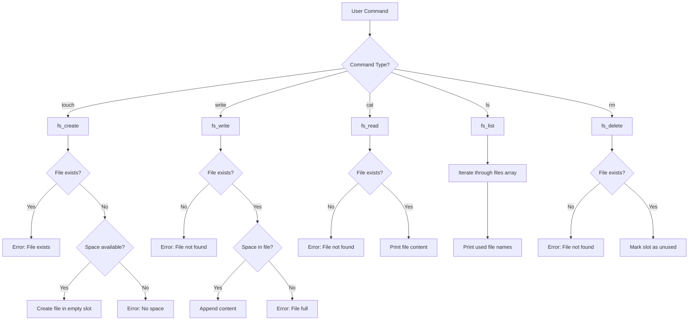

# In-Memory File System

## Overview

SimpleOS implements a basic in-memory file system that stores files in RAM. Files are lost when the system reboots, but the system provides a simple interface for creating, reading, writing, and deleting files.

## Architecture

### File Structure

```c
typedef struct {
    char name[32];      // File name (max 31 characters + null terminator)
    char content[512];  // File content (max 512 bytes)
    bool used;          // Is this slot occupied?
} file_t;
```

### File System Storage

```c
#define MAX_FILES 16
file_t files[MAX_FILES];  // Array of 16 files
```

**Total Memory Usage**: 16 × (32 + 512 + 1) = 8,720 bytes (~8.5 KB)

## File System Operations

### 1. Initialize File System

```c
void fs_init(void) {
    for (int i = 0; i < MAX_FILES; i++) {
        files[i].used = false;
        files[i].name[0] = '\0';
        files[i].content[0] = '\0';
    }
}
```

Called during shell initialization to mark all file slots as unused.

### 2. Create File (touch)

```c
int fs_create(const char *filename) {
    // Check if file already exists
    for (int i = 0; i < MAX_FILES; i++) {
        if (files[i].used && strcmp(files[i].name, filename) == 0) {
            return -1;  // File already exists
        }
    }

    // Find empty slot
    for (int i = 0; i < MAX_FILES; i++) {
        if (!files[i].used) {
            files[i].used = true;
            strcpy(files[i].name, filename);
            files[i].content[0] = '\0';
            return 0;  // Success
        }
    }

    return -2;  // No space available
}
```

**Usage**: `touch filename.txt`

### 3. Write to File

```c
int fs_write(const char *filename, const char *content) {
    // Find file
    for (int i = 0; i < MAX_FILES; i++) {
        if (files[i].used && strcmp(files[i].name, filename) == 0) {
            // Append content
            int current_len = strlen(files[i].content);
            int content_len = strlen(content);
            
            if (current_len + content_len < 512) {
                strcat(files[i].content, content);
                return 0;  // Success
            }
            return -2;  // File full
        }
    }
    return -1;  // File not found
}
```

**Usage**: 
```
write filename.txt
This is line 1
This is line 2
EOF
```

### 4. Read File (cat)

```c
int fs_read(const char *filename, char *buffer, int size) {
    for (int i = 0; i < MAX_FILES; i++) {
        if (files[i].used && strcmp(files[i].name, filename) == 0) {
            strcpy(buffer, files[i].content);
            return 0;  // Success
        }
    }
    return -1;  // File not found
}
```

**Usage**: `cat filename.txt`

### 5. List Files (ls)

```c
void fs_list(void) {
    int count = 0;
    for (int i = 0; i < MAX_FILES; i++) {
        if (files[i].used) {
            print(files[i].name);
            print("\n");
            count++;
        }
    }
    if (count == 0) {
        print("No files found.\n");
    }
}
```

**Usage**: `ls`

### 6. Delete File (rm)

```c
int fs_delete(const char *filename) {
    for (int i = 0; i < MAX_FILES; i++) {
        if (files[i].used && strcmp(files[i].name, filename) == 0) {
            files[i].used = false;
            files[i].name[0] = '\0';
            files[i].content[0] = '\0';
            return 0;  // Success
        }
    }
    return -1;  // File not found
}
```

**Usage**: `rm filename.txt`

## File System Limitations

| Limitation | Value | Reason |
|------------|-------|--------|
| Max Files | 16 | Fixed array size |
| Max Filename Length | 31 characters | 32-byte buffer (including null terminator) |
| Max File Size | 512 bytes | Fixed content buffer |
| Persistence | None | Files stored in RAM only |
| Directories | Not supported | Flat file system |
| Permissions | Not supported | No user/access control |

## File System Flow Diagram



## Example Usage Session

```
SimpleOS> touch hello.txt
File created: hello.txt

SimpleOS> write hello.txt
Enter text (type 'EOF' on a new line to finish):
Hello, World!
This is a test file.
EOF
File written: hello.txt

SimpleOS> ls
hello.txt

SimpleOS> cat hello.txt
Hello, World!
This is a test file.

SimpleOS> rm hello.txt
File deleted: hello.txt

SimpleOS> ls
No files found.
```


