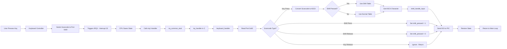

# Keyboard Input System

## Overview

The keyboard input system handles PS/2 keyboard input through hardware interrupts (IRQ1). When a key is pressed, the keyboard controller sends a scancode to the CPU, triggering an interrupt that is processed by the keyboard driver.

## Keyboard Input Flow



## Scancode to ASCII Conversion

### Scancode Tables

The keyboard driver uses two lookup tables to convert scancodes to ASCII:

**Normal Keys** (`scancode_to_ascii`):
```c
const char scancode_to_ascii[] = {
    0, 0, '1', '2', '3', '4', '5', '6', '7', '8', '9', '0', '-', '=', '\b',
    '\t', 'q', 'w', 'e', 'r', 't', 'y', 'u', 'i', 'o', 'p', '[', ']', '\n',
    0, 'a', 's', 'd', 'f', 'g', 'h', 'j', 'k', 'l', ';', '\'', '`',
    0, '\\', 'z', 'x', 'c', 'v', 'b', 'n', 'm', ',', '.', '/', 0,
    '*', 0, ' '
};
```

**Shifted Keys** (`scancode_to_ascii_shift`):
```c
const char scancode_to_ascii_shift[] = {
    0, 0, '!', '@', '#', '$', '%', '^', '&', '*', '(', ')', '_', '+', '\b',
    '\t', 'Q', 'W', 'E', 'R', 'T', 'Y', 'U', 'I', 'O', 'P', '{', '}', '\n',
    0, 'A', 'S', 'D', 'F', 'G', 'H', 'J', 'K', 'L', ':', '"', '~',
    0, '|', 'Z', 'X', 'C', 'V', 'B', 'N', 'M', '<', '>', '?', 0,
    '*', 0, ' '
};
```

### Special Scancodes

| Scancode | Key | Action |
|----------|-----|--------|
| 0x2A | Left Shift Press | Set `shift_pressed = 1` |
| 0x36 | Right Shift Press | Set `shift_pressed = 1` |
| 0xAA | Left Shift Release | Set `shift_pressed = 0` |
| 0xB6 | Right Shift Release | Set `shift_pressed = 0` |
| >= 0x80 | Any Key Release | Ignored |

## Keyboard Handler Implementation

### File: `kernel/drivers/keyboard.c`

```c
void keyboard_handler(registers_t regs) {
    uint8_t scancode = port_byte_in(0x60);  // Read scancode from keyboard port

    // Handle shift keys
    if (scancode == 0x2A || scancode == 0x36) {
        shift_pressed = 1;
        return;
    }
    if (scancode == 0xAA || scancode == 0xB6) {
        shift_pressed = 0;
        return;
    }

    // Ignore key release events (scancode >= 0x80)
    if (scancode >= 0x80) {
        return;
    }

    // Convert scancode to ASCII
    char c;
    if (scancode < sizeof(scancode_to_ascii)) {
        if (shift_pressed) {
            c = scancode_to_ascii_shift[scancode];
        } else {
            c = scancode_to_ascii[scancode];
        }

        if (c != 0) {
            // Route input to shell
            shell_handle_input(c);
        }
    }
}
```

## Shell Input Processing

### File: `kernel/shell.c`

The shell processes keyboard input character by character:

```c
void shell_handle_input(char c) {
    if (c == '\n') {
        // Enter key - execute command
        command_buffer[command_index] = '\0';
        shell_execute(command_buffer);
        command_index = 0;
        command_buffer[0] = '\0';
    }
    else if (c == '\b') {
        // Backspace - remove last character
        if (command_index > 0) {
            command_index--;
            command_buffer[command_index] = '\0';
            // Erase character on screen
            int cursor = get_cursor();
            cursor -= 2;
            set_cursor(cursor);
            print_char(' ');
            set_cursor(cursor);
        }
    }
    else {
        // Regular character - add to buffer
        if (command_index < MAX_COMMAND_LENGTH - 1) {
            command_buffer[command_index] = c;
            command_index++;
            print_char(c);  // Echo to screen
        }
    }
}
```

## Hardware Details

### PS/2 Keyboard Controller

**Port 0x60**: Data Port
- Read: Get scancode from keyboard
- Write: Send command to keyboard

**Port 0x64**: Status/Command Port
- Read: Get controller status
- Write: Send command to controller

### IRQ1 Configuration

The keyboard interrupt (IRQ1) is configured during system initialization:

1. **PIC Remapping** (`isr_init`): IRQ1 is remapped to interrupt 33
2. **IDT Entry** (`idt_set_gate`): Interrupt 33 points to `irq1` handler
3. **Enable Interrupts** (`sti`): CPU begins accepting interrupts


