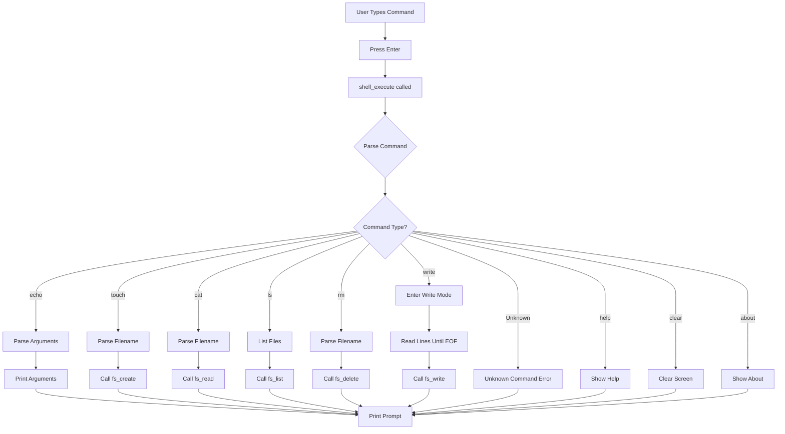

# Shell Commands Reference

## Overview

The SimpleOS shell provides a command-line interface for interacting with the operating system. Commands are parsed and executed by the shell interpreter.

## Command List

### System Commands

#### `help`
Display list of available commands.

**Syntax**: `help`

**Example**:
```
SimpleOS> help
Available commands:
  help   - Show this help message
  clear  - Clear the screen
  about  - Display system information
  echo   - Print text to screen
  touch  - Create a new file
  write  - Write content to a file
  cat    - Display file contents
  ls     - List all files
  rm     - Delete a file
```

---

#### `clear`
Clear the screen and reset cursor to top-left.

**Syntax**: `clear`

**Example**:
```
SimpleOS> clear
[Screen is cleared]
```

---

#### `about`
Display system information including OS name, version, and author.

**Syntax**: `about`

**Example**:
```
SimpleOS> about
SimpleOS v0.2
A simple operating system written in C and Assembly
Author: [Your Name]
```

---

#### `echo`
Print text to the screen.

**Syntax**: `echo <text>`

**Example**:
```
SimpleOS> echo Hello, World!
Hello, World!
```

---

### File System Commands

#### `touch`
Create a new empty file.

**Syntax**: `touch <filename>`

**Parameters**:
- `filename`: Name of the file to create (max 31 characters)

**Return Values**:
- Success: "File created: <filename>"
- Error: "File already exists" or "No space available"

**Example**:
```
SimpleOS> touch test.txt
File created: test.txt

SimpleOS> touch test.txt
Error: File already exists
```

**Limitations**:
- Maximum 16 files can be created
- Filename cannot exceed 31 characters
- No directory support (flat namespace)

---

#### `write`
Write content to an existing file.

**Syntax**: 
```
write <filename>
<line 1>
<line 2>
...
EOF
```

**Parameters**:
- `filename`: Name of the file to write to
- Content: Multiple lines of text
- `EOF`: Special marker to end input

**Return Values**:
- Success: "File written: <filename>"
- Error: "File not found" or "File is full"

**Example**:
```
SimpleOS> write test.txt
Enter text (type 'EOF' on a new line to finish):
This is line 1
This is line 2
This is line 3
EOF
File written: test.txt
```

**Limitations**:
- File must exist (use `touch` first)
- Maximum 512 bytes per file
- Content is appended to existing content

---

#### `cat`
Display the contents of a file.

**Syntax**: `cat <filename>`

**Parameters**:
- `filename`: Name of the file to display

**Return Values**:
- Success: Displays file content
- Error: "File not found"

**Example**:
```
SimpleOS> cat test.txt
This is line 1
This is line 2
This is line 3
```

---

#### `ls`
List all files in the file system.

**Syntax**: `ls`

**Example**:
```
SimpleOS> ls
test.txt
hello.txt
data.txt

SimpleOS> ls
No files found.
```

**Output**:
- Lists one file per line
- Shows only file names (no size, date, or permissions)
- If no files exist, displays "No files found."

---

#### `rm`
Delete a file from the file system.

**Syntax**: `rm <filename>`

**Parameters**:
- `filename`: Name of the file to delete

**Return Values**:
- Success: "File deleted: <filename>"
- Error: "File not found"

**Example**:
```
SimpleOS> rm test.txt
File deleted: test.txt

SimpleOS> rm nonexistent.txt
Error: File not found
```

**Note**: Deletion is permanent (no recycle bin or undo)

---

## Command Parsing

### How Commands Are Processed



### Command Parser Implementation

```c
void shell_execute(char *command) {
    if (strcmp(command, "help") == 0) {
        // Show help
    }
    else if (strcmp(command, "clear") == 0) {
        clear_screen();
    }
    else if (strncmp(command, "echo ", 5) == 0) {
        print(command + 5);  // Skip "echo "
        print("\n");
    }
    else if (strncmp(command, "touch ", 6) == 0) {
        char *filename = command + 6;
        fs_create(filename);
    }
    // ... more commands
    else {
        print("Unknown command: ");
        print(command);
        print("\n");
    }
}
```

## Special Features

### Input Editing

- **Backspace**: Remove last character from input buffer
- **Enter**: Execute command
- **Printable Characters**: Add to input buffer (max 256 characters)

### Write Mode

When using the `write` command, the shell enters a special write mode:

1. Prompts for input
2. Reads lines one at a time
3. Appends each line to file content
4. Exits when "EOF" is entered
5. Returns to normal command mode


