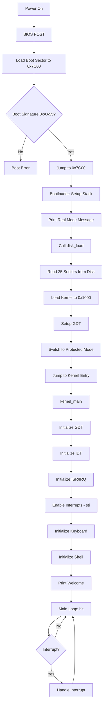
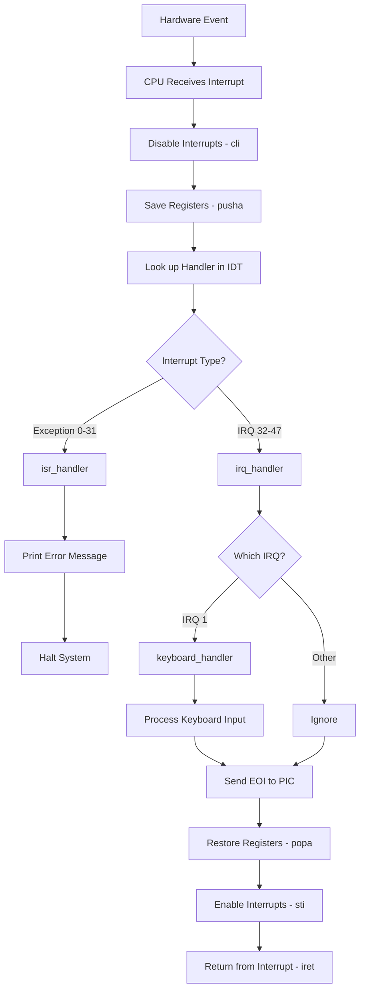
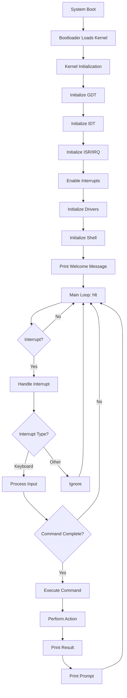

# SimpleOS System Overview

## Table of Contents
1. [Introduction](#introduction)
2. [System Architecture](#system-architecture)
3. [Boot Process](#boot-process)
4. [Memory Layout](#memory-layout)
5. [Interrupt System](#interrupt-system)
6. [Device Drivers](#device-drivers)
7. [File System](#file-system)
8. [Shell and Commands](#shell-and-commands)

## Introduction

SimpleOS is a minimal, educational 32-bit operating system written in C and x86 Assembly. It demonstrates fundamental OS concepts including:

- Bootloader development
- Real mode to protected mode transition
- Interrupt handling (IDT, ISR, IRQ)
- Device drivers (keyboard, VGA display)
- Memory management
- Simple file system
- Command-line shell

**Current Version:** 0.2.0  
**Architecture:** x86 (32-bit)  
**Boot Method:** BIOS Legacy Boot  
**Display:** VGA Text Mode (80x25)  
**Kernel Size:** ~12KB  

## System Architecture

### High-Level Architecture

```
┌─────────────────────────────────────────────────────────┐
│                    User Interface                        │
│              (Shell - Command Interpreter)               │
└─────────────────────────────────────────────────────────┘
                          ↓
┌─────────────────────────────────────────────────────────┐
│                  System Services                         │
│  ┌──────────────┐  ┌──────────────┐  ┌──────────────┐  │
│  │  File System │  │    Memory    │  │    String    │  │
│  │   (In-RAM)   │  │  Management  │  │  Utilities   │  │
│  └──────────────┘  └──────────────┘  └──────────────┘  │
└─────────────────────────────────────────────────────────┘
                          ↓
┌─────────────────────────────────────────────────────────┐
│                  Device Drivers                          │
│  ┌──────────────┐  ┌──────────────┐  ┌──────────────┐  │
│  │   Keyboard   │  │  VGA Screen  │  │     Ports    │  │
│  │   (PS/2)     │  │  (Text Mode) │  │   (I/O)      │  │
│  └──────────────┘  └──────────────┘  └──────────────┘  │
└─────────────────────────────────────────────────────────┘
                          ↓
┌─────────────────────────────────────────────────────────┐
│              Hardware Abstraction Layer                  │
│  ┌──────────────┐  ┌──────────────┐  ┌──────────────┐  │
│  │     GDT      │  │     IDT      │  │   ISR/IRQ    │  │
│  │  (Segments)  │  │ (Interrupts) │  │  (Handlers)  │  │
│  └──────────────┘  └──────────────┘  └──────────────┘  │
└─────────────────────────────────────────────────────────┘
                          ↓
┌─────────────────────────────────────────────────────────┐
│                   Hardware (x86 CPU)                     │
└─────────────────────────────────────────────────────────┘
```

### Component Overview

| Component | Location | Purpose |
|-----------|----------|---------|
| Bootloader | `boot/boot.asm` | Loads kernel, switches to protected mode |
| Kernel Entry | `kernel/kernel_entry.asm` | Assembly entry point for kernel |
| Kernel Main | `kernel/kernel.c` | Main kernel initialization and loop |
| GDT | `kernel/cpu/gdt.c` | Memory segmentation |
| IDT | `kernel/cpu/idt.c` | Interrupt descriptor table |
| ISR/IRQ | `kernel/cpu/isr.c` | Interrupt service routines |
| Keyboard Driver | `kernel/drivers/keyboard.c` | PS/2 keyboard input |
| Screen Driver | `kernel/drivers/screen.c` | VGA text output |
| File System | `kernel/filesystem/filesystem.c` | In-memory file storage |
| Shell | `kernel/shell.c` | Command interpreter |

## Boot Process

### Overview

The boot process consists of three main stages:

1. **BIOS Stage**: Hardware initialization and bootloader loading
2. **Bootloader Stage**: Kernel loading and mode switching
3. **Kernel Stage**: System initialization and main loop

### Detailed Boot Sequence

```
Power On
   ↓
┌──────────────────────────────────────────────────────────┐
│ STAGE 1: BIOS (Basic Input/Output System)               │
├──────────────────────────────────────────────────────────┤
│ 1. POST (Power-On Self Test)                            │
│ 2. Initialize hardware (CPU, RAM, devices)              │
│ 3. Search for bootable device                           │
│ 4. Load first sector (512 bytes) to 0x7C00              │
│ 5. Verify boot signature (0xAA55)                       │
│ 6. Jump to 0x7C00                                        │
└──────────────────────────────────────────────────────────┘
   ↓
┌──────────────────────────────────────────────────────────┐
│ STAGE 2: Bootloader (16-bit Real Mode)                  │
├──────────────────────────────────────────────────────────┤
│ File: boot/boot.asm                                      │
│                                                          │
│ 1. Save boot drive number (from DL register)            │
│ 2. Setup stack (BP=0x9000, SP=0x9000)                   │
│ 3. Print: "Started in 16-bit Real Mode"                 │
│ 4. Load kernel from disk:                               │
│    - Read 25 sectors (12.5 KB)                          │
│    - Load to memory address 0x1000                      │
│ 5. Print: "Kernel loaded OK!"                           │
│ 6. Setup GDT (Global Descriptor Table)                  │
│ 7. Switch to 32-bit Protected Mode                      │
│ 8. Jump to kernel entry point                           │
└──────────────────────────────────────────────────────────┘
   ↓
┌──────────────────────────────────────────────────────────┐
│ STAGE 3: Kernel Initialization (32-bit Protected Mode)  │
├──────────────────────────────────────────────────────────┤
│ File: kernel/kernel.c                                    │
│                                                          │
│ 1. gdt_init()      - Initialize GDT                     │
│ 2. idt_init()      - Setup IDT (256 entries)            │
│ 3. isr_init()      - Install ISR/IRQ handlers           │
│ 4. keyboard_init() - Initialize keyboard driver         │
│ 5. shell_init()    - Initialize shell and file system   │
│ 6. Print welcome message                                │
│ 7. Enter main loop (hlt instruction)                    │
└──────────────────────────────────────────────────────────┘
   ↓
System Ready - Waiting for User Input
```

### Boot Process Flowchart



## Memory Layout

### Physical Memory Map

```
┌─────────────────────┬──────────────┬─────────────────────────────┐
│   Address Range     │     Size     │         Description         │
├─────────────────────┼──────────────┼─────────────────────────────┤
│ 0x00000000          │              │                             │
│        to           │    1 KB      │ Interrupt Vector Table      │
│ 0x000003FF          │              │ (Real Mode - unused)        │
├─────────────────────┼──────────────┼─────────────────────────────┤
│ 0x00000400          │              │                             │
│        to           │   256 B      │ BIOS Data Area              │
│ 0x000004FF          │              │                             │
├─────────────────────┼──────────────┼─────────────────────────────┤
│ 0x00000500          │              │                             │
│        to           │  ~29 KB      │ Free Memory                 │
│ 0x00007BFF          │              │                             │
├─────────────────────┼──────────────┼─────────────────────────────┤
│ 0x00007C00          │              │ Bootloader Code             │
│        to           │   512 B      │ (Loaded by BIOS)            │
│ 0x00007DFF          │              │                             │
├─────────────────────┼──────────────┼─────────────────────────────┤
│ 0x00007E00          │              │                             │
│        to           │  ~4.5 KB     │ Free Memory                 │
│ 0x00008FFF          │              │                             │
├─────────────────────┼──────────────┼─────────────────────────────┤
│ 0x00009000          │              │ Stack (grows downward)      │
│        to           │  ~28 KB      │ BP = 0x9000                 │
│ 0x0000FFFF          │              │ SP starts at 0x9000         │
├─────────────────────┼──────────────┼─────────────────────────────┤
│ 0x00001000          │              │ Kernel Code & Data          │
│        to           │  ~12 KB      │ (Loaded by bootloader)      │
│ 0x00003FFF          │              │                             │
├─────────────────────┼──────────────┼─────────────────────────────┤
│ 0x00004000          │              │                             │
│        to           │  ~624 KB     │ Free Memory (Heap)          │
│ 0x0009FFFF          │              │                             │
├─────────────────────┼──────────────┼─────────────────────────────┤
│ 0x000A0000          │              │                             │
│        to           │   128 KB     │ VGA Video Memory            │
│ 0x000BFFFF          │              │                             │
├─────────────────────┼──────────────┼─────────────────────────────┤
│ 0x000B8000          │              │ VGA Text Mode Buffer        │
│        to           │   4000 B     │ (80x25 characters)          │
│ 0x000B8FA0          │              │ 2 bytes per character       │
├─────────────────────┼──────────────┼─────────────────────────────┤
│ 0x000C0000          │              │                             │
│        to           │   256 KB     │ BIOS ROM                    │
│ 0x000FFFFF          │              │                             │
└─────────────────────┴──────────────┴─────────────────────────────┘
```

### Kernel Memory Layout

```
Kernel Binary (loaded at 0x1000):

┌─────────────────────────────────────┐ 0x1000
│  .text (Code Segment)               │
│  - kernel_entry.asm                 │
│  - kernel.c compiled code           │
│  - All driver code                  │
│  - Shell code                       │
├─────────────────────────────────────┤
│  .data (Initialized Data)           │
│  - Global variables                 │
│  - String constants                 │
│  - Lookup tables                    │
├─────────────────────────────────────┤
│  .bss (Uninitialized Data)          │
│  - File system array                │
│  - Command buffer                   │
│  - Stack variables                  │
└─────────────────────────────────────┘ ~0x4000
```

## Interrupt System

### Interrupt Descriptor Table (IDT)

The IDT is a table of 256 interrupt handlers that tells the CPU what code to execute when an interrupt occurs.

**Structure:**
- **Entries 0-31**: CPU Exceptions (divide by zero, page fault, etc.)
- **Entries 32-47**: Hardware Interrupts (IRQs, remapped from 0-15)
- **Entries 48-255**: Available for software interrupts

### IRQ Remapping

The Programmable Interrupt Controller (PIC) is remapped to avoid conflicts with CPU exceptions:

```text
Original IRQ Mapping (conflicts with CPU exceptions):
IRQ 0-7  → INT 0x08-0x0F
IRQ 8-15 → INT 0x70-0x77

Remapped IRQ Mapping (used by SimpleOS):
IRQ 0-7  → INT 0x20-0x27 (32-39)
IRQ 8-15 → INT 0x28-0x2F (40-47)
```

### Important Interrupts

| Interrupt | Type | Description | Handler |
|-----------|------|-------------|---------|
| 0 | Exception | Divide by Zero | `isr0` |
| 13 | Exception | General Protection Fault | `isr13` |
| 14 | Exception | Page Fault | `isr14` |
| 32 | IRQ 0 | Timer | `irq0` |
| **33** | **IRQ 1** | **Keyboard** | **`irq1`** |
| 34 | IRQ 2 | Cascade (internal) | `irq2` |
| 35-47 | IRQ 3-15 | Other hardware | `irq3-irq15` |

### Interrupt Flow Diagram



## Device Drivers

### VGA Text Mode Driver

**File**: `kernel/drivers/screen.c`

The VGA driver provides text output capabilities using VGA text mode.

**Features**:
- 80 columns × 25 rows
- 16 colors (foreground and background)
- Hardware cursor
- Automatic scrolling

**VGA Memory Layout**:
```text
Base Address: 0xB8000
Size: 4000 bytes (2 bytes per character)

Character Format:
┌─────────┬─────────────┐
│ Byte 0  │   Byte 1    │
│ ASCII   │  Attribute  │
└─────────┴─────────────┘

Attribute Byte:
┌───────────┬───────────┐
│ Bits 7-4  │ Bits 3-0  │
│Background │Foreground │
└───────────┴───────────┘

Default: 0x0F (White on Black)
```

**Key Functions**:
- `print(char *str)` - Print string
- `print_char(char c)` - Print single character
- `clear_screen()` - Clear screen
- `set_cursor(int offset)` - Set cursor position
- `get_cursor()` - Get cursor position

### Keyboard Driver

**File**: `kernel/drivers/keyboard.c`

Handles PS/2 keyboard input through IRQ1.

**Features**:
- Scancode to ASCII conversion
- Shift key support
- Special key handling (Enter, Backspace)

**Key Functions**:
- `keyboard_init()` - Initialize keyboard
- `keyboard_handler(registers_t regs)` - IRQ1 handler

See [KEYBOARD_INPUT.md](KEYBOARD_INPUT.md) for detailed documentation.

### Port I/O Driver

**File**: `kernel/drivers/ports.c`

Provides low-level port I/O operations.

**Functions**:
```c
uint8_t port_byte_in(uint16_t port);    // Read byte from port
void port_byte_out(uint16_t port, uint8_t data);  // Write byte to port
uint16_t port_word_in(uint16_t port);   // Read word from port
void port_word_out(uint16_t port, uint16_t data); // Write word to port
```

**Common Ports**:

| Port | Purpose |
|------|---------|
| 0x60 | Keyboard data |
| 0x64 | Keyboard status/command |
| 0x3D4 | VGA cursor control |
| 0x3D5 | VGA cursor data |
| 0x20 | Master PIC command |
| 0x21 | Master PIC data |
| 0xA0 | Slave PIC command |
| 0xA1 | Slave PIC data |

## File System

SimpleOS implements a basic in-memory file system with the following features:

- **Storage**: RAM-based (non-persistent)
- **Capacity**: 16 files maximum
- **File Size**: 512 bytes per file
- **Filename Length**: 31 characters maximum
- **Operations**: Create, Read, Write, Delete, List

See [FILE_SYSTEM.md](FILE_SYSTEM.md) for detailed documentation.

## Shell and Commands

The shell provides a command-line interface for user interaction.

**Available Commands**:
- `help` - Show available commands
- `clear` - Clear screen
- `about` - System information
- `echo <text>` - Print text
- `touch <file>` - Create file
- `write <file>` - Write to file
- `cat <file>` - Display file
- `ls` - List files
- `rm <file>` - Delete file

See [SHELL_COMMANDS.md](SHELL_COMMANDS.md) for detailed command reference.

## System Execution Flow



## Building and Running

### Prerequisites

- `nasm` - Netwide Assembler
- `i686-elf-gcc` - Cross-compiler for x86
- `i686-elf-ld` - Linker
- `qemu-system-i386` - Emulator (for testing)

### Build Commands

```bash
# Clean build directory
make clean

# Build OS image
make all

# Run in QEMU
make run

# Build and run
make clean && make all && make run
```

### Build Output

```text
build/
├── boot.bin           # Bootloader (512 bytes)
├── kernel.bin         # Kernel binary (~12 KB)
├── os-image.bin       # Complete OS image (boot + kernel)
└── kernel/            # Object files
    ├── kernel.o
    ├── shell.o
    └── ...
```

## Technical Specifications

| Specification | Value |
|---------------|-------|
| Architecture | x86 (32-bit) |
| Boot Method | BIOS Legacy Boot |
| Boot Sector Size | 512 bytes |
| Kernel Size | ~12 KB |
| Total Image Size | ~12.5 KB |
| Memory Model | Flat (no paging) |
| Segmentation | GDT with 3 segments |
| Interrupts | IDT with 256 entries |
| Display Mode | VGA Text Mode 80x25 |
| Keyboard | PS/2 via IRQ1 |
| File System | In-memory, 16 files max |

## Future Enhancements

Potential improvements for SimpleOS:

- [ ] Paging and virtual memory
- [ ] Multi-tasking and process scheduling
- [ ] Disk I/O (ATA/IDE driver)
- [ ] Persistent file system (FAT12/FAT16)
- [ ] User mode and system calls
- [ ] More device drivers (mouse, serial port)
- [ ] Network stack (basic TCP/IP)
- [ ] Graphics mode support

## References

- [OSDev Wiki](https://wiki.osdev.org/) - Comprehensive OS development resource
- [Intel x86 Manual](https://www.intel.com/content/www/us/en/developer/articles/technical/intel-sdm.html) - CPU architecture reference
- [BIOS Interrupt Calls](http://www.ctyme.com/intr/int.htm) - BIOS services reference

